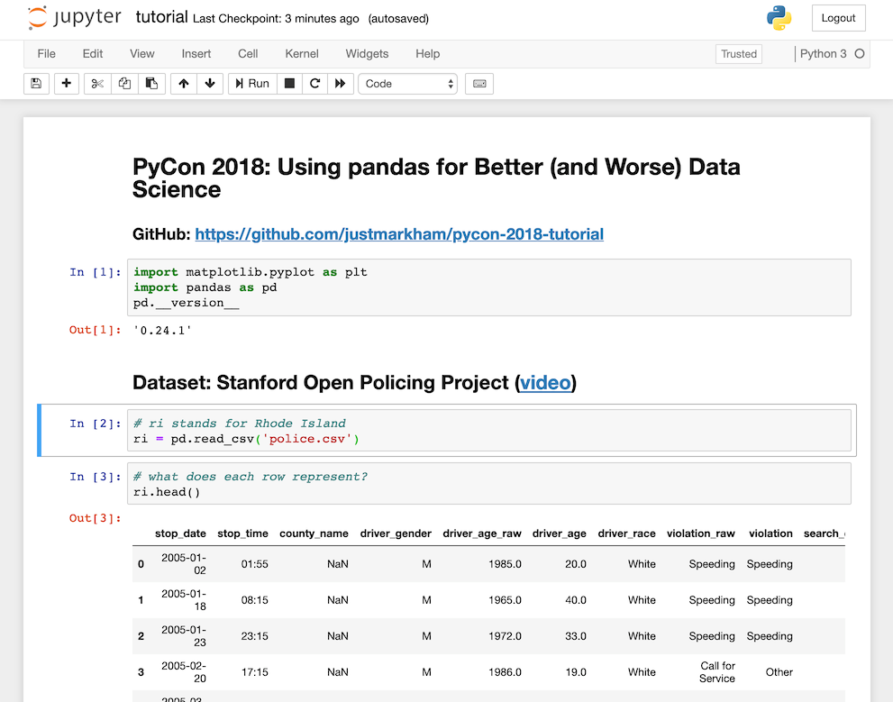

# WM164 Smart Solutions Development I / Block 3 / Tuesday

## Version control terminology

| Terminology     | Definition                                                                               |
| --------------- | ---------------------------------------------------------------------------------------- |
| Version control | The process of tracking versions of files through time.                                  |
| Distributed     | Stored in multiple locations.                                                            |
| Check out       | Moving the HEAD to a new location (i.e. new branch).                                     |
| Commit          | Saving a new version of file(s), optionally with a comment                               |
| Repository      | A server which stores all commits, and tracks pointers to these commits (branches, tags) |
| Staging area    | Changes here will be saved upon the next commit.                                         |
| Timeline        | A list of all commits from the HEAD, in reverse chronological order (old to new).        |

## Homework

### Jupyter Notebooks

Jupyter notebooks are a way of embedding structured Python code around textual content. This is particularly useful for demos or notes.

It allows Python code to be inlined around various other documentation. For example, you could use the code to demonstrate the concept written about in notes.

Each individual snippet runs in the context of all other previous snippets, allowing you to break sections of code up and still have them run as if they were one continuous file.



### How to avoid the `if` hell mentioned at the beginning of the lecture?

Use early-exits where possible, where you check against a condition then use a `return` statement to prevent further execution of the function. This means that an `else` statement is not needed, hence less indentation is needed.

```py
def myFunc():
  x = True

  if x:
    # do something if x is True
    return

  # do something if x is False
```

Furthermore, sometimes a huge chain of `if`/`elif`/`else` isn't even needed and another way is suitable and provides the same result without "`if` hell".

You can also split the various conditions and branches into different functions and call those functions instead.
